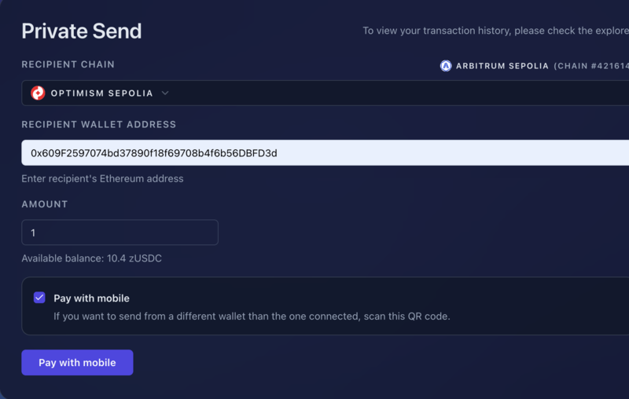

# プライベート転送

このガイドでは、zERC20 ウェブアプリを使ったプライベート転送（Private Transfer）の送受金方法を説明します。

## プライベート送金を行う

### アドレスに直接送金する

受信者のアドレスがわかっている場合：

1. [フロントエンド](https://app.zerc20.io/) にアクセス
2. 「Private Send」タブをクリック
3. ドロップダウンで受信者のチェーンを選択
4. 受信者のアドレスまたは ENS 名（.eth、.base.eth）を入力
5. 送金する zERC20 の金額を入力
6. 「Send Privately」をクリック

<figure><figcaption>
プライベート送金フォーム
</figcaption></figure>

転送は以下の3ステップで処理されます：

1. **生成**：バーンアドレス（Burn Address）と暗号化アナウンスを生成
2. **保存**：暗号化アナウンスをオンチェーンまたはオフチェーンに保存（後で受信者が Scan して確認）
3. **送金**：バーンアドレスにトークンを送信

<figure><figcaption>
転送の進行状況
</figcaption></figure>

完了すると成功メッセージが表示されます：

<figure><figcaption>
転送成功
</figcaption></figure>

### バーンアドレスに送金する

相手からバーンアドレスを受け取っている場合：

1. MetaMask（または任意のウォレット）を開く
2. 提供されたバーンアドレスに zERC20 を送金
3. 完了 — 引き出しは受信者が行います

サポートされている任意のチェーンから送金できます。送信者にも引き出し先アドレスを知られたくない場合に適した方法です。

## 他者向けのバーンアドレスを作成する

「Pay with mobile」機能を使うと、他者が送金できるバーンアドレスを生成できます。以下のような場面で役立ちます：

* 送金者に引き出し先アドレスを知られずに支払いを受け取る
* QR コードで共有できる支払いリクエストを作成する
* 受信者の代わりに第三者に支払ってもらう

バーンアドレスの作成手順：

1. 送金ページに移動
2. 受信者の引き出し先アドレスと金額を入力
3. **「Pay with mobile」** オプションにチェックを入れる
4. 「Pay with mobile」をクリック

<figure><figcaption>
Pay with Mobile フォーム
</figcaption></figure>

5. バーンアドレスを含む QR コードが生成される
6. 支払い者に QR コードを共有する

<figure><figcaption>
Pay with Mobile QR コード
</figcaption></figure>

支払い者は QR コードをスキャンし、表示されたバーンアドレスに指定の金額を送金するだけです。オンチェーンで支払いが確認されると、受信者が資金を引き出せます。

## 受け取りと引き出し

プライベート転送の受け取りと引き出しの詳細は [Scan で受け取りを確認する](scan-receives.md) を参照してください。
