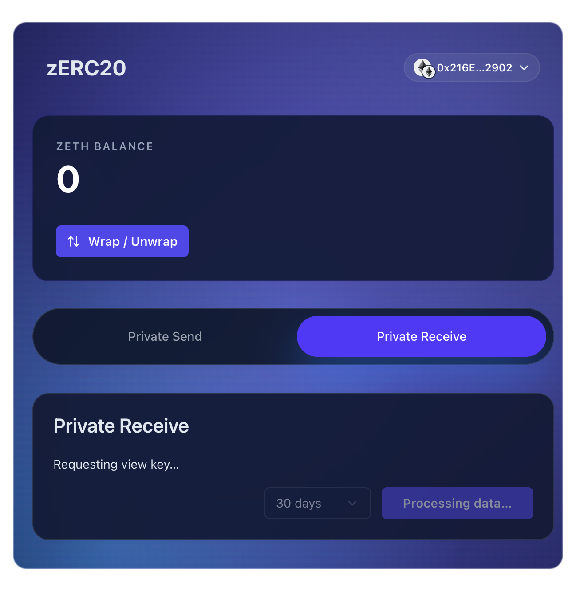
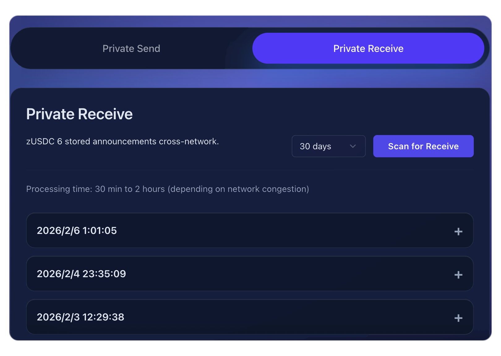
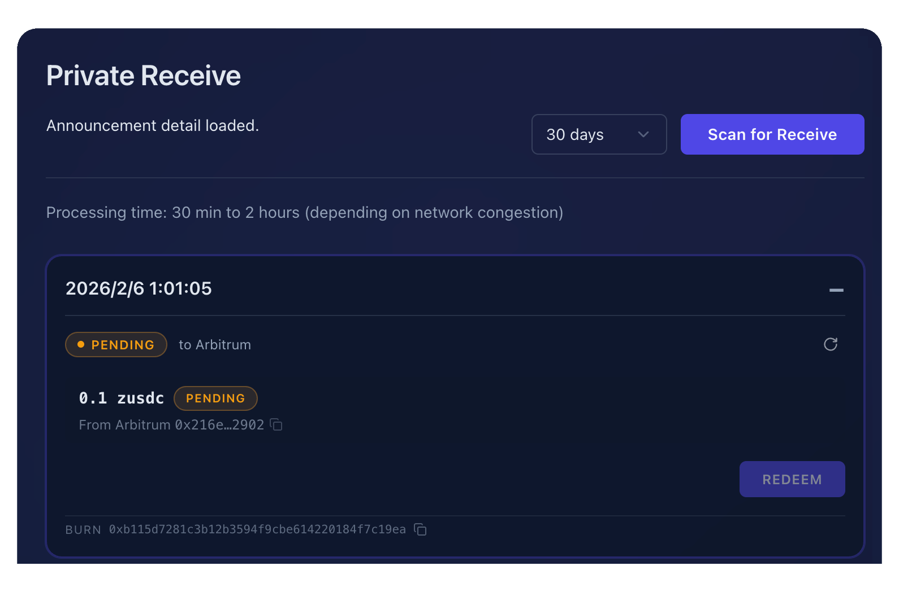
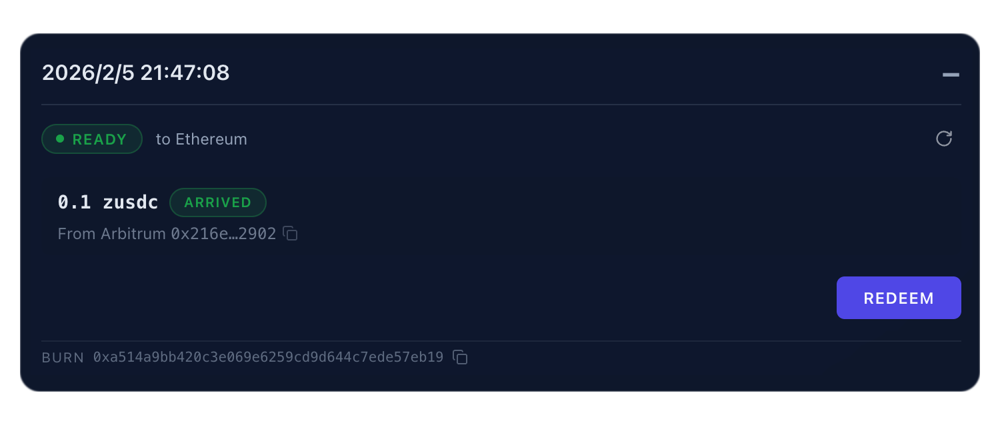
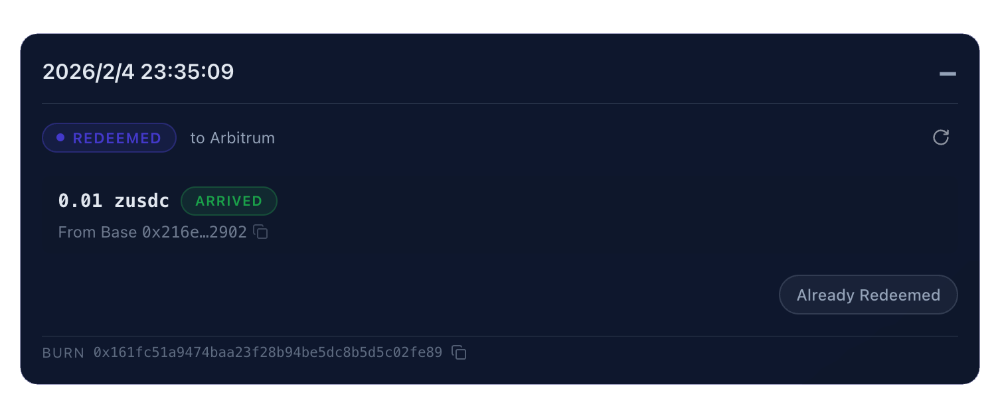

# Scan for Receiveで受け取りを確認する

## Private Receive にアクセスする

1. [フロントエンド](https://app.zerc20.io/) にアクセス
2. ウォレットを接続
3. 「Private Receive」タブをクリック

## 受信転送を Scan する

受け取ったプライベート転送を確認するには：

1. 「Scan for Receive」ボタンをクリック
2. システムが view key を要求し、アナウンスを Scan します

Scan の処理内容：

* ウォレットから view key を取得（このキーであなた宛のアナウンスを復号します）
* サポートされている全チェーンで暗号化アナウンスを検索
* あなたのウォレット宛のアナウンスを復号
* 秘密鍵や送金能力は一切開示されません

## 受け取り済み転送を確認する

Scan 完了後、受け取った転送がタイムスタンプ順に一覧表示されます：

アナウンスの **+** ボタンをクリックすると詳細が展開されます。

## アナウンス詳細

各アナウンスは以下のステータスで管理されます：

| ステータス        | 意味                         |
| ------------ | -------------------------- |
| **PENDING**  | 転送を検出済み、まだ引き出し可能な状態になっていない |
| **READY**    | 転送が確認済みで、引き出し可能な状態         |
| **REDEEMED** | 資金の引き出しが完了済み               |

アナウンスをクリックすると詳細が表示されます：

詳細画面の表示内容：

* **ステータス**：転送の現在の状態（PENDING / READY / REDEEMED）
* **送金先チェーン**：資金を引き出せるチェーン
* **金額とトークン**：受け取った zERC20 の金額
* **送信元**：送信元チェーンと送金者アドレス
* **バーンアドレス**：転送に使用されたバーンアドレス（Burn Address）

## 資金を引き出す

転送のステータスが **READY**（「ARRIVED」と表示）になったら：

1. アナウンスを展開する
2. 「REDEEM」ボタンをクリック

3. ZKP（Zero-Knowledge Proof）の生成とトランザクションの完了を待つ（資金の引き出し権限を証明するZKPが作成されます）
4. 完了するとステータスが **REDEEMED** に変わり、ボタンが「Already Redeemed」と表示されます

資金は接続中のウォレットアドレスに送金されます。

## トラブルシューティング

### アナウンスが見つからない場合

Scan で結果が表示されない場合：

* 正しいウォレットで接続しているか確認する
* 転送のオンチェーン確認を待つ（数分かかる場合があります）
* 送金者が正しい受信者アドレスを使用しているか確認する

## 次のステップ

* [プライベート転送](private-transfer.md) — プライベート転送の送金方法
* [フロントエンドを使いはじめる](getting-started.md) — フロントエンドの概要
* [FAQ](../faq.md) — よくある質問とトラブルシューティング
