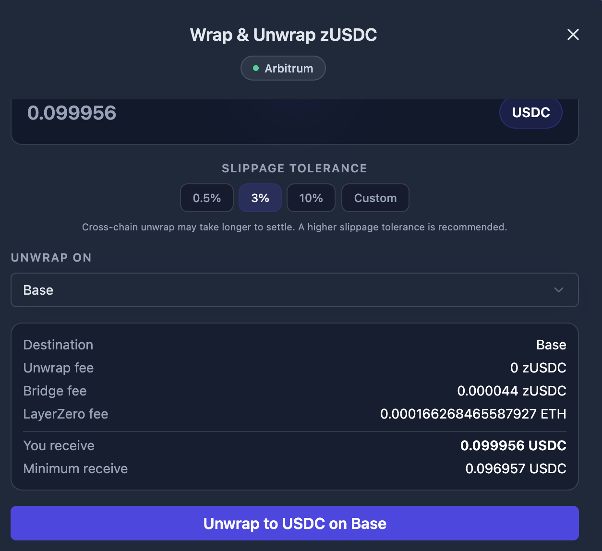

# フロントエンドを使いはじめる

このガイドでは、zERC20 ウェブアプリの基本的な使い方を説明します。

## ステップ1：フロントエンドにアクセスする

[zERC20 フロントエンド](https://app.zerc20.io/) にアクセスしてください。

> **💡 Hint：** テストトークンで試したい場合は、[Testnet フロントエンド](https://v2.testnet.app.zerc20.io/) を使用してください。

<figure><figcaption>ダッシュボード概要</figcaption></figure>

## ステップ2：ウォレットを接続する

1. 右上の「Connect Wallet」をクリック
2. ウォレットプロバイダーを選択（MetaMask、WalletConnect など）
3. ウォレット上で接続リクエストを承認

接続が完了すると、ウォレットアドレスとトークン残高がダッシュボードに表示されます。

## ステップ3：zERC20 トークンを入手する

zERC20 トークンは、原資産トークンに1:1でバックされた ERC-20 ラッパートークン（Wrapper Token）です。ERC-20 との完全な互換性を維持しながら、プライベート転送（Private Transfer）を実現します。

ページ上部のドロップダウンでトークンの種類とチェーンを選択できます：

| トークン選択 | チェーン選択 |
|:--------------:|:--------------:|
|  |  |

### 方法A：トークンをWrapする

Wrap とは、標準トークン（USDC、ETH など）を zERC20 トークンに1:1で変換することです。

1. 「Wrap / Unwrap」ボタンをクリック
2. 「WRAP」タブを選択
3. Wrap するトークンを選択（USDC、ETH、BNB など）
4. 金額を入力

<figure><figcaption>Wrap モーダル — 変換する金額を入力</figcaption></figure>

5. 「Wrap USDC to zUSDC」（または対応するトークン）をクリック
6. ウォレットでトランザクションを承認
7. 同量の zERC20 トークンを受け取り

> **📃 Note：** チェーンの流動性が低い場合、流動性提供のボーナスとして Wrapリワードを受け取れる場合があります。詳細は [手数料とリワード](../fees-and-rewards.md) を参照してください。

Wrap 完了後、残高が更新されます：

<figure><figcaption>更新された zERC20 残高を表示するダッシュボード</figcaption></figure>

### 方法B：DEXで購入する

Uniswap などの分散型取引所で zERC20 を直接購入できます。

> **📃 Note：** 各チェーンのトークンアドレスは [コントラクトアドレス](../../reference/addresses.md) を参照してください。

### zERC20 トークンをUnwrapする

zERC20 トークンを原資産トークンに戻す手順：

1. 「Wrap / Unwrap」ボタンをクリック
2. 「UNWRAP」タブを選択
3. 金額を入力
4. スリッページ許容値を設定（0.5%、3%、10%、またはカスタム）
5. 「UNWRAP ON」ドロップダウンで送金先チェーンを選択

**同一チェーンでのUnwrap：**

「Chain (Current)」を選択すると、現在のチェーンで原資産トークンを受け取れます。

<figure><figcaption>現在のチェーンへUnwrap</figcaption></figure>

**クロスチェーンUnwrap：**

「UNWRAP ON」ドロップダウンで別のチェーンを選択すると、他のチェーンの流動性にアクセスできます。処理の流れは以下の通りです：

1. 現在のチェーン（Chain A）の zERC20 トークンを LayerZero 経由で目的チェーン（Chain B）にブリッジ
2. Chain B で原資産トークン（USDC など）にUnwrap
3. 原資産トークンを Chain A にブリッジして返送

例えば Arbitrum にいる場合に「Base」を選択すると、フローは **Arbitrum → Base → Arbitrum** となります。Unwrap は Base で行われますが、原資産トークンは Arbitrum で受け取れます。

<figure><figcaption>別のネットワークの流動性を使ったクロスチェーンUnwrap</figcaption></figure>

トランザクション確認前に手数料の内訳（Unwrap手数料・ブリッジ手数料・LayerZero手数料）が表示されます。

> **💡 Hint：** 現在のチェーンの流動性が低くUnwrap手数料が高い場合、クロスチェーンUnwrapを使うと別チェーンの流動性にアクセスして手数料を抑えられます。フロントエンドに手数料比較が表示されるので、最適な方法を選べます。詳細は [手数料とリワード](../fees-and-rewards.md) を参照してください。

## ステップ4：プライベート転送を行う

送金方法の詳細は [プライベート転送ガイド](private-transfer.md) を参照してください。

受け取り方法の詳細は [Scan 受け取りガイド](scan-receives.md) を参照してください。

## 重要な注意事項

- **クロスチェーン対応**：LayerZero メッセージングを使って、あるチェーンで送金し別のチェーンで引き出せます
- **処理時間**：Mainnet でのプライベート転送は通常30分〜1時間かかります
- **Testnet の制限**：LayerZero の不安定性により、Testnet では処理に時間がかかる場合があります

## 次のステップ

- [プライベート転送（フロントエンド）](private-transfer.md) — プライベートに送受金する
- [FAQ](../faq.md) — よくある質問とトラブルシューティング
